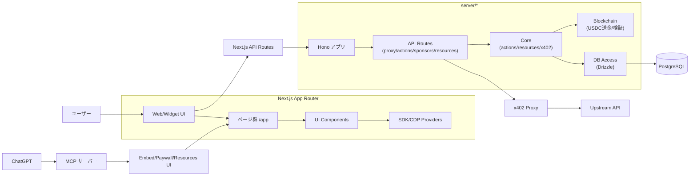
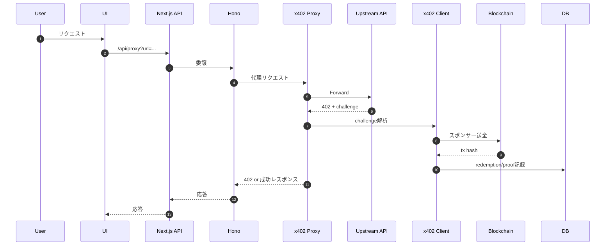
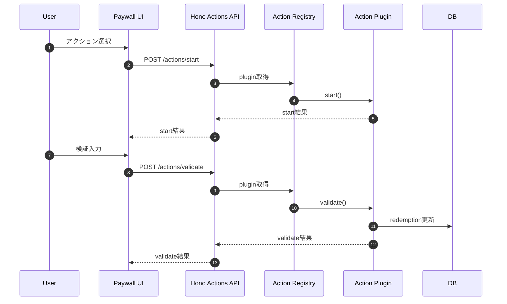
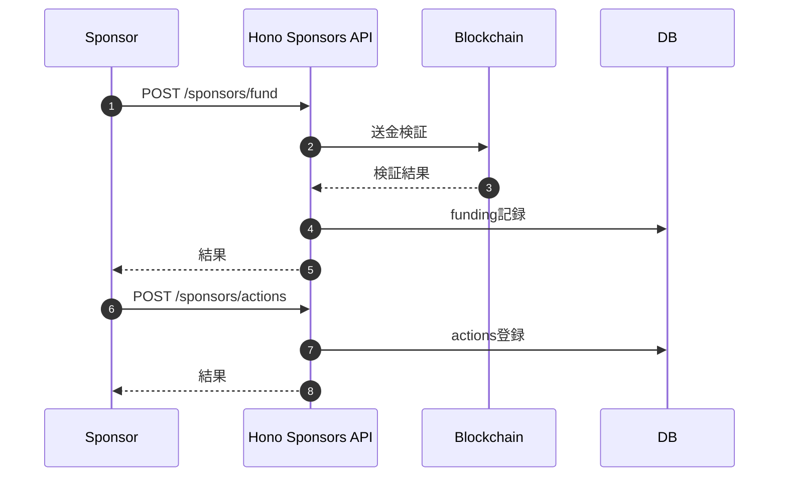
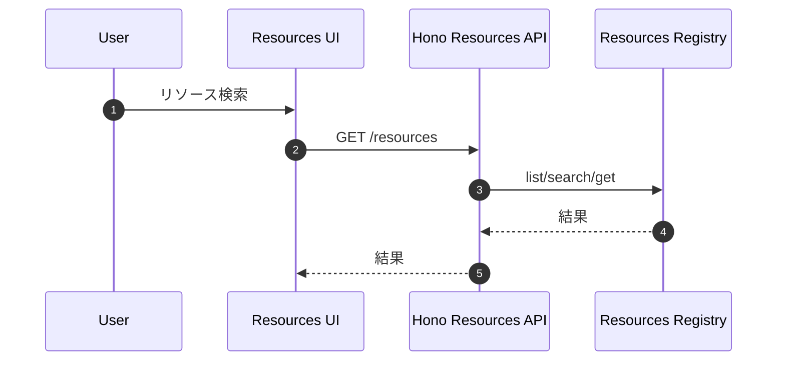
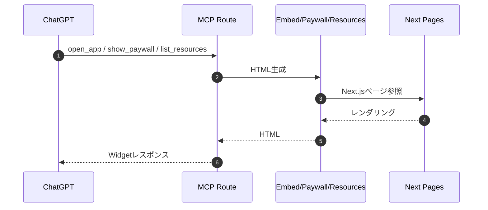

# ソースコード分析レポート

## 1. 概要
Payload Exchange は、x402 の支払い要求をプロキシで仲介し、スポンサーがユーザーのアクションと引き換えに支払いを肩代わりできる仕組みを提供するアプリです。MCP（Model Context Protocol）を通じて ChatGPT にウィジェットを返し、Paywall / Resource Viewer を表示します。

## 2. アーキテクチャ全体像
### 2.0 Mermaid（全体フロー）


### 2.1 フロントエンド（Next.js）
- UI/ページ: Next.js App Router
  - Paywall: [app/paywall/page.tsx](app/paywall/page.tsx)
  - Resource Viewer: [app/resources/page.tsx](app/resources/page.tsx)
  - Embed（ChatGPT連携向け）: [app/embed/page.tsx](app/embed/page.tsx)
- コンポーネント:
  - Paywall UI: [components/paywall-widget.tsx](components/paywall-widget.tsx)
  - CDP Wallet Auth: [components/wallet-auth.tsx](components/wallet-auth.tsx)
- SDK/ランタイム補助:
  - ChatGPT iframe/SDK補助: [app/layout.tsx](app/layout.tsx)
  - OpenAI Apps SDK Provider: [components/apps-sdk-ui-provider.tsx](components/apps-sdk-ui-provider.tsx)
  - CDP Provider: [components/cdp-provider.tsx](components/cdp-provider.tsx)

### 2.2 API / サーバー
- Next.js API → Hono へ委譲
  - [app/api/payload/route.ts](app/api/payload/route.ts)
  - [app/api/proxy/route.ts](app/api/proxy/route.ts)
- Hono ルーティング
  - ルート定義: [server/hono/app.ts](server/hono/app.ts)
  - Proxy: [server/hono/routes/proxy.ts](server/hono/routes/proxy.ts)
  - Actions: [server/hono/routes/actions.ts](server/hono/routes/actions.ts)
  - Sponsors: [server/hono/routes/sponsors.ts](server/hono/routes/sponsors.ts)
  - Resources: [server/hono/routes/resources.ts](server/hono/routes/resources.ts)

### 2.3 MCPサーバー（ChatGPT連携）
- MCPハンドラ: [app/mcp/route.ts](app/mcp/route.ts)
  - `open_app`, `get_resource_by_url`, `list_resources`, `search_resources`, `show_paywall` を提供
  - Paywall / Resource Viewer の HTML を動的に取得しウィジェットとして返却

### 2.4 データ層
- Drizzle + Neon(Postgres)
  - DB クライアント: [server/db/client.ts](server/db/client.ts)
  - スキーマ: [server/db/schema.ts](server/db/schema.ts)
  - クエリ: [server/db/queries.ts](server/db/queries.ts)

## 3. 主要機能フロー
### 3.1 x402 プロキシ（支払い/スポンサー処理）
- 入口: [server/hono/routes/proxy.ts](server/hono/routes/proxy.ts)
- 主要流れ
  1) 受信リクエストを upstream へ転送
  2) 402 Response を受けた場合、x402 challenge を解析
  3) スポンサーアクションが有れば「スポンサー支払い」ロジックを適用
  4) スポンサーが負担する分の USDC をユーザーへ送金
  5) redemption と proof を記録

### 3.2 Paywall UI とアクション処理
- Paywall UI: [components/paywall-widget.tsx](components/paywall-widget.tsx)
  - x402 の直接支払い (CDP Wallet)
  - アクション実行（survey / email / github-star / code-verification）
- アクションの開始・検証 API: [server/hono/routes/actions.ts](server/hono/routes/actions.ts)
  - `POST /actions/start` → plugin.start
  - `POST /actions/validate` → plugin.validate → redemption の更新
- アクションプラグイン
  - インターフェース: [server/core/actions/action-plugin.ts](server/core/actions/action-plugin.ts)
  - 登録: [server/core/actions/registry.ts](server/core/actions/registry.ts)
  - 実装例:
    - Email: [server/core/actions/plugins/email-capture.ts](server/core/actions/plugins/email-capture.ts)
    - Survey: [server/core/actions/plugins/survey.ts](server/core/actions/plugins/survey.ts)
    - GitHub Star: [server/core/actions/plugins/github-star.ts](server/core/actions/plugins/github-star.ts)
    - Code Verification: [server/core/actions/plugins/code-verification.ts](server/core/actions/plugins/code-verification.ts)

### 3.3 Sponsors / Funding
- Sponsors API: [server/hono/routes/sponsors.ts](server/hono/routes/sponsors.ts)
  - 資金入金/検証: `POST /sponsors/fund`
  - 行動プラグイン作成: `POST /sponsors/actions`
  - Proof 参照: `/sponsors/proofs`
- USDC 送金・検証
  - 送金: [server/core/blockchain/send-usdc.ts](server/core/blockchain/send-usdc.ts)
  - 取引検証: [server/core/blockchain/verify-transaction.ts](server/core/blockchain/verify-transaction.ts)

### 3.4 Resources
- 登録リソース（静的JSON）: [server/core/resources/registry.ts](server/core/resources/registry.ts)
- ルート: [server/hono/routes/resources.ts](server/hono/routes/resources.ts)
- UI: [app/resources/page.tsx](app/resources/page.tsx)

### 3.5 機能一覧表
| 機能 | 概要 | 主な入口 | 主な参照 |
| --- | --- | --- | --- |
| x402 プロキシ | 402チャレンジ解析・スポンサー支払いを伴うプロキシ | /api/proxy → Hono proxy | [server/hono/routes/proxy.ts](server/hono/routes/proxy.ts) / [server/core/x402/client.ts](server/core/x402/client.ts) |
| Paywall UI | 支払い/アクション実行 UI | /paywall | [components/paywall-widget.tsx](components/paywall-widget.tsx) |
| アクション実行/検証 | plugin.start / plugin.validate | /actions/start / /actions/validate | [server/hono/routes/actions.ts](server/hono/routes/actions.ts) / [server/core/actions/registry.ts](server/core/actions/registry.ts) |
| Sponsors/Funding | 入金・アクション作成・Proof参照 | /sponsors/* | [server/hono/routes/sponsors.ts](server/hono/routes/sponsors.ts) |
| Resources | リソース一覧/検索/取得 | /resources | [server/hono/routes/resources.ts](server/hono/routes/resources.ts) |
| MCP 連携 | ChatGPT へ埋め込みUI返却 | /mcp | [app/mcp/route.ts](app/mcp/route.ts) |

### 3.6 機能毎の処理シーケンス図
#### 3.6.1 x402 プロキシ（支払い/スポンサー処理）


#### 3.6.2 Paywall UI とアクション実行


#### 3.6.3 Sponsors / Funding


#### 3.6.4 Resources


#### 3.6.5 MCP 連携


## 4. データモデル（要点）
- sponsors: スポンサーのウォレット・残高
- actions: スポンサーが提供するアクション定義
- redemptions: アクション実行履歴・状態
- funding_transactions: 入金履歴
- response_proofs: VLayer で生成した証明データ
- 定義: [server/db/schema.ts](server/db/schema.ts)

## 5. 設計上の特徴・強み
- x402 / MCP / CDP 連携が統合されており、ChatGPT 内で Paywall を完結できる
- Hono による API 集約と、Next.js からの委譲が明確
- 402 応答を解析しスポンサー支払いに移行するフローが整理されている
- VLayer による証明の保存（任意機能）で監査性を高める設計

## 6. リスク・技術的課題
1) **x402 支払いがスタブ実装**
   - [server/core/x402/client.ts](server/core/x402/client.ts) はスタブで実際の支払い処理が未実装
2) **スポンサー支払い → upstream 402 の再試行が未実装**
   - スポンサー送金後も upstream への再試行は行わず、402 を返している
3) **GitHub Star 検証の未実装**
   - [server/core/actions/plugins/github-star.ts](server/core/actions/plugins/github-star.ts) で API 検証が TODO
4) **Code Verification の期待コード**
   - [server/core/actions/plugins/code-verification.ts](server/core/actions/plugins/code-verification.ts) は config の `code` と照合するのみで、start で生成したコードが validate に活きない
5) **DB 接続必須**
   - [server/db/client.ts](server/db/client.ts) で DATABASE_URL が無いと即エラー
6) **セキュリティ**
   - CORS が全許可（`origin: *`）
   - `/sponsors/*` や `/actions/*` は基本的にヘッダ値のみでアクセス制御
7) **CDP Project ID がデフォルト値**
   - [components/cdp-provider.tsx](components/cdp-provider.tsx) に固定の projectId がある

## 7. 改善提案（優先度順）
1) **x402 決済処理の本実装**
   - [server/core/x402/client.ts](server/core/x402/client.ts) のスタブを置換
2) **スポンサー支払い後の自動再試行**
   - proxy でスポンサー送金後、x-payment を付与して再試行する設計へ
3) **アクション検証の実装強化**
   - GitHub Star の検証を GitHub API で実装
   - Code Verification の期待コードの保存（DB/キャッシュ）
4) **認可/認証の強化**
   - Sponsors/Actions API の認証導入（署名検証など）
5) **CORS制限**
   - 公開環境では `origin` 制限・ヘッダ制限を導入

## 8. 実行手順（ローカルで動かす）

### 8.1 前提

- Node.js 18+（推奨: pnpm）
- PostgreSQL（ローカル or Neon）
- CDP Project ID（Embedded Wallet）

### 8.2 依存関係のインストール

```bash
pnpm install
```

### 8.3 環境変数の設定
1) [.env.example](.env.example) を参考に .env.local を作成
2) 最低限以下を設定
  - TUNNEL_URL（例: http://localhost:3000）
  - DATABASE_URL（Postgres接続）
  - NEXT_PUBLIC_CDP_PROJECT_ID（CDP Project ID）
  - TREASURY_WALLET_ADDRESS / TREASURY_PRIVATE_KEY
3) 任意（必要時）
  - BASE_RPC_URL（Base RPC）
  - X402_ENDPOINT（x402の実装に応じて）
  - VLAYER_API_ENDPOINT / VLAYER_CLIENT_ID / VLAYER_BEARER_TOKEN

### 8.4 DBセットアップ
```bash
pnpm db:generate
pnpm db:migrate
```
開発用途であれば `pnpm db:push` でも可。

### 8.5 開発サーバー起動
```bash
pnpm dev
```
起動後に http://localhost:3000 を開く。

### 8.6 MCP（ChatGPT連携）
- MCPエンドポイント: /mcp
- ローカル検証では `http://localhost:3000/mcp`
- デプロイ後はホストの /mcp を ChatGPT の Connector に設定

### 8.7 動作確認の簡易チェック
- Paywall UI: /paywall
- Resource Viewer: /resources
- Proxy: /api/proxy?url=... （x402対応のリソース URL を指定）

## 9. 参考ファイルリンク
- MCP サーバ: [app/mcp/route.ts](app/mcp/route.ts)
- Proxy 実装: [server/hono/routes/proxy.ts](server/hono/routes/proxy.ts)
- Paywall UI: [components/paywall-widget.tsx](components/paywall-widget.tsx)
- DB スキーマ: [server/db/schema.ts](server/db/schema.ts)
- X402 スタブ: [server/core/x402/client.ts](server/core/x402/client.ts)

---

必要であれば、改善提案の実装計画や優先度に合わせたタスク分割も提示します。